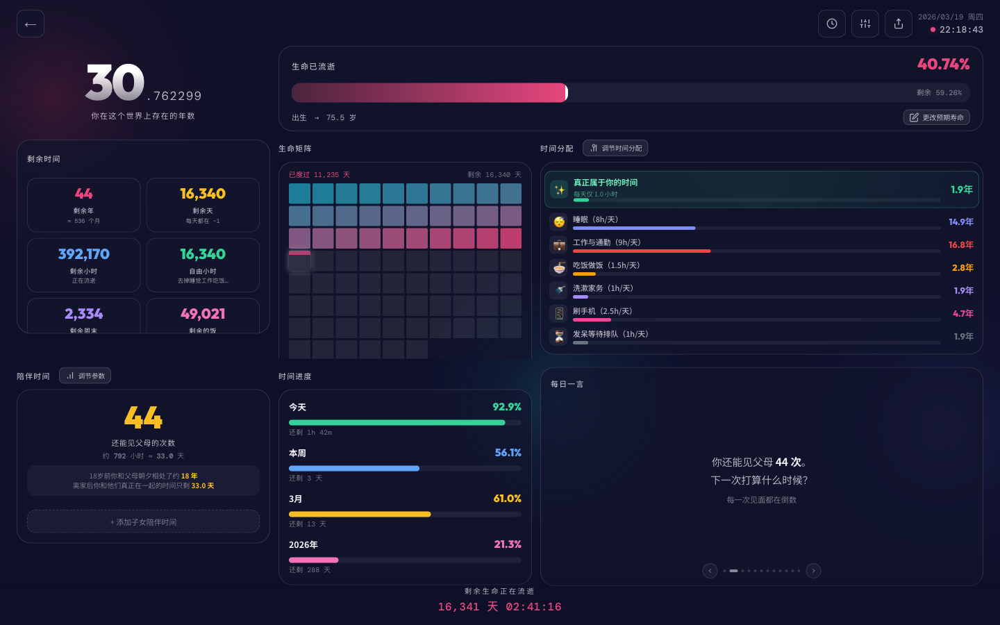
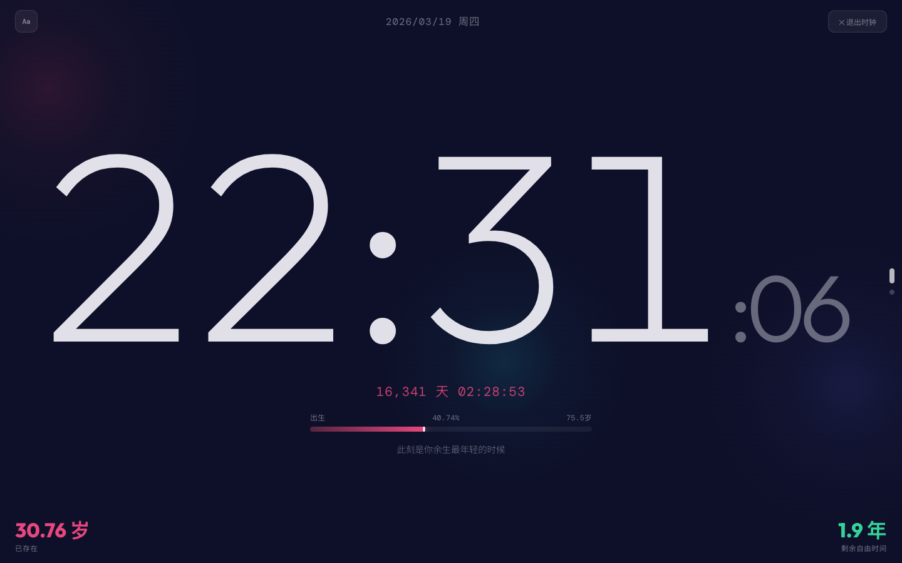
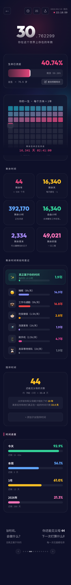

# Life Hourglass | 生命沙漏

A visual life countdown timer that puts the passage of time into perspective through interactive visualizations.

## Features

- **Life progress bar** — real-time percentage of life elapsed with animated progress track
- **Life dot matrix** — each square = 1 year, color-coded for lived / current / remaining
- **Remaining time cards** — years, days, hours, free time, weekends, and meals left
- **Time allocation breakdown** — shows how remaining years split across sleep, work, phone, chores, and truly free time
- **Companion time calculator** — estimates remaining visits with parents (and optionally children), with adjustable parameters
- **Desk clock mode** — fullscreen multi-page clock
- **Customizable settings** — adjust expected lifespan, daily time allocation, companion parameters via modal dialogs
- **Shareable reports** — each generated report gets a short unique URL (`?r=abc123`) stored in Supabase, shareable as read-only links
- **Mobile-friendly** — responsive design with safe area support

## Live Demo

Open via GitHub Pages: [https://forest0xia.github.io/life-countdown/](https://forest0xia.github.io/life-countdown/)

## Screenshots

### Desktop

### Desk Clock

### Mobile (iPhone Pro)

  

## Usage

Open `index.html` in any modern browser — no build step or server required.

To deploy via GitHub Pages, enable Pages in your repo settings with the `main` branch as source.

## Privacy & Security

- **No personal data collection.** The app does not collect, store, or transmit any personally identifiable information.
- The only data stored in Supabase is: birth date, sex (male/female), region (country code), and expected lifespan — used solely to generate shareable report links.
- No authentication, no cookies, no tracking, no analytics.
- All report data is anonymous — there is no way to link a report to a specific individual.
- Supabase access uses a public (anon) key with row-level security; no sensitive credentials are exposed.

## Tech Stack

- Single HTML file, vanilla JavaScript — zero dependencies, no build tools
- Supabase (free tier) for anonymous report storage
- Google Fonts for typography
